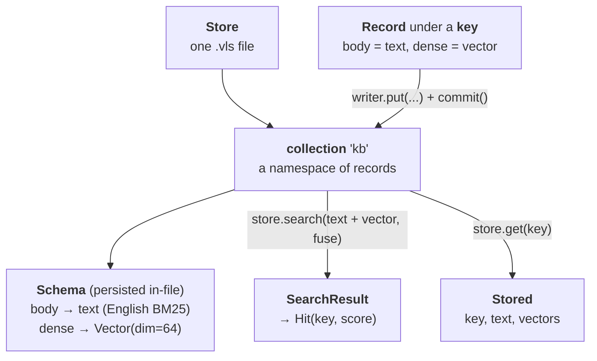

# Data model — how it fits together

Valise has four core nouns (plus one advanced one). Learn how they relate once
and the rest of the API reads itself.



## The nouns

| Noun | What it is | Scope | Persisted? |
|---|---|---|---|
| **Store** | the single `.vls` file — the root of everything | the file | — |
| **Collection** | a named namespace of records that share one schema | a slice of the file | yes |
| **Schema** | the collection's named fields: text fields (analyzer) and vector fields (dim, metric, codec, calibration) | per collection | **yes** — reopen restores it, no re-declaration |
| **Record** | the field values for one **key**: text, vector(s), optional time/parent | one entry | yes |
| **Space** *(advanced)* | a shared compatibility boundary two collections can bind the same field to | file-global | yes |

The relationship in one sentence: **a collection's schema names its fields and
their behavior, and each record fills those fields under a stable key.**

By default you never touch spaces: each inline field quietly gets a private
one (named `~auto/{collection}/{field}`). Spaces only appear when two
collections must share one embedding space — see
[Schemas & Spaces](spaces.md).

## The lifecycle

1. **Declare a collection** with a [`Schema`](spaces.md) — one call,
   idempotent, persisted in-file.
2. **Write** records through a single [`Writer`](records.md): stage many
   `put`/`put_many`/`delete`, then one `commit()` — the durability barrier
   (and, for an auto-calibrating vector field, the calibration barrier).
3. **Read**: `store.get(coll, key) → Stored`, or
   `store.search(coll, ...) → SearchResult` of `Hit(key, score)`.

```python
import numpy as np
from valise import Store, Schema, Vector, Record, Search

store = Store.open("kb.vls")    # open-or-create

# 1. one call declares the fields (persisted in the file)
store.collection("kb", Schema().text("body").vector("dense", Vector(dim=64)))

# 2. records fill those fields under a key; commit is the barrier
#    (`vec` here is a stand-in — real vectors come from your embedding model)
vec = np.zeros(64, dtype=np.float32)
with store.writer() as w:
    w.put("kb", "rust", Record().text("body", "Rust gives memory safety.").vector("dense", vec))
    w.commit()

# 3. read it back two ways
store.get("kb", "rust").text                                  # 'Rust gives memory safety.'
store.search("kb", Search().text("body", "memory").top_k(5)).keys  # ['rust']

# later / another process: reopen restores the schema
store = Store.open("kb.vls")
store.get("kb", "rust").text                                  # just works
```

## How a record is stored (one level deeper)

Under the hood a record lowers to a single engine **frame** (the text payload +
its key) plus one stored **vector** per vector field. You rarely touch frames
directly, but two consequences surface in the API:

- **Keys are the identity.** A `str | int | bytes` key is persisted with the
  frame, so `put` / `get` / `delete` work by key across an append-only file, and
  survive a reopen. See [Records](records.md).
- **`child_of` builds a tree.** A record can be a child of another (a document →
  chunk relationship), which the frame model captures natively.

## Next

- [Schemas & Spaces](spaces.md) — field specs, codec choice, the `dim % 64`
  rule, shared spaces.
- [Records](records.md) — keys, timestamps, reading back `Stored`.
- [Search & Fusion](search.md) — text + vector channels, RRF, `SearchResult`.
- [Partitions](partitions.md) — time-partitioned collections, views,
  `forget_before`.
